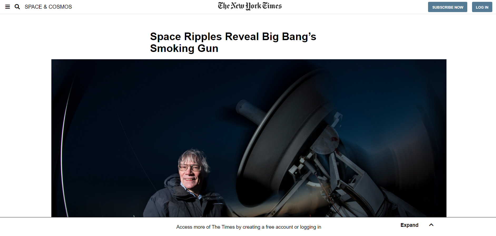

# NYT Article Clones

> Made as the third HTML/CSS project in the Microverse curriculum

## Built With

- HTML
- CSS

## Live Demo

[Live Demo Link](https://karmaester.github.io/NYT-Article-Cloned/)

## Authors

👤 **karmaester**

- Github: [@githubhandle](https://github.com/karmaester)
- Twitter: [@twitterhandle](https://twitter.com/karmaendlich)
- Linkedin: [linkedin](https://www.linkedin.com/in/khristian-rojas/)

👤 **martinnajjar12**

- Github: [@githubhandle](https://github.com/martinnajjar12)
- Twitter: [@twitterhandle](https://twitter.com/martin_najjar)
- Linkedin: [linkedin](https://www.linkedin.com/in/martin-najjar-174948198/)

## 🤝 Contributing

Contributions, issues and feature requests are welcome!

Feel free to check the [issues page](https://github.com/karmaester/NYT-Article-Cloned/issues).

## Show your support

Give a ⭐️ if you like this project!

## Acknowledgments

- Inspired on older versions of this New York Times article 
https://www.nytimes.com/2014/03/18/science/space/detection-of-waves-in-space-buttresses-landmark-theory-of-big-bang.html?_r=0
## 📝 License

This project is [MIT](lic.url) licensed.
